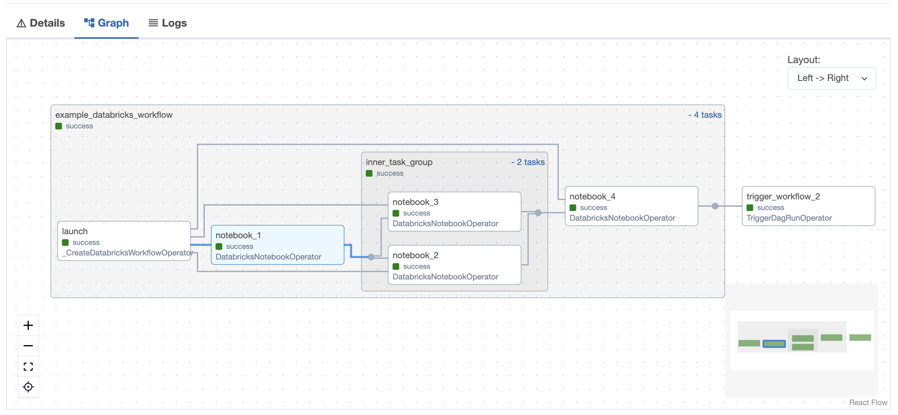
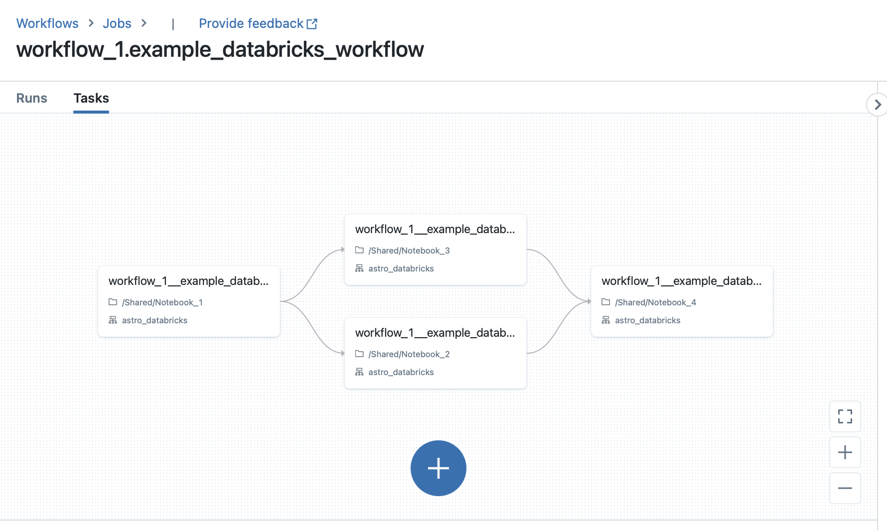

# Databricks Workflow Demo

This is a demo of using Airflow and the [astro-provider-databricks](https://github.com/astronomer/astro-provider-databricks) to declare Databricks Workflows using Airflow. There are currently two DAGs in this repo:

- `workflow_1`: Runs 4 notebooks with a TaskGroup and then trigger `workflow_2`
- `workflow_2`: Runs 2 notebooks sequentially

## Screenshots

### Workflow 1: Airflow



### Workflow 1: Databricks



## Setup

1. Clone this repo
2. Create an `airflow_settings.yaml` file in the root of this repo with the following contents:

```yaml
# airflow_settings.yaml
airflow:
  connections:
    - conn_id: databricks_default
      conn_type: databricks
      conn_host: https://dbc-... # your databricks workspace url
      conn_login: user@domain.com # your databricks login email
      conn_password: dapi... # your databricks personal access token
```

3. Run `astro dev start` to start Airflow
